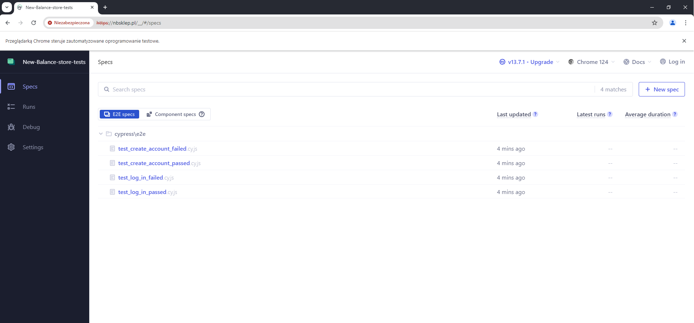

# General Info #

New-Balance-store-tests is a Cypress-JavaScript project aimed at testing and presenting the results of New-Balance-store-tests. 

## Functionality ##

The project contains four tests: 
1) Successful logging test 
2) Unsuccessful logging test 
3) Successful account creation test 
4) Unsuccessful account creation test

## Testing environnement ##

The script as tested for windows 10 Home ( 22H2 64bits)

## Technologies ##

Technologies used: Cypress, JavaScript.

## Getting Started ##

1. Install 
    ```
    "Node.js" from https://nodejs.org/en
    "Visual Studio Code" from https://code.visualstudio.com
    ```
2. In Visual Studio Code install 
    ```
    "HTML5 extension pack".
    "JavaScript (ES6) code snippets".
    "Live Server".
    "vscode-icons".
    "Doki Theme".
    "Cypress Snippets".
    ```
3. Installing "Git Bash" terminal.
In Visual Studio Code click "File"-> "Preferences" -> "Settings" -> "Code Actions On Save" -> "Edit in settings.json". In "Edit in settings.json" file insert "terminal.integrated.shell.windows": "absolute path to the "bash.exe" and the next click save and restart Visual Studio Code. Now you can use "Git Bash" terminal.
4. In Visual Studio Code click "Terminal" -> "New Terminal" and in the lower right corner choose "Git Bash" Terminal.

## Installing Cypress ##

1. In the "Git Bash" insert "npm init" command and press "enter".
2. Fill in the text fields, insert "yes" and press "enter".
3. In the "Git Bash" insert "npm install cypress --save-dev" command.
4. In the "Git Bash" insert "npx cypress open" and press "enter".
5. Next click:
    "E2E Testing"
    "Continue"
    "Start E2E Testing in Chrome"
6. In the "Git Bash" insert "npm install -D cypress-xpath". 
   Then include in your project's "e2e.js" file:
    ```
    require('cypress-xpath');
    ```
   
7. ### Uncaught Exceptions ###
   #### To turn off all uncaught exception handling ####
   A great place to put this configuration is in the supportFile(In this case it is "e2e.js" file), since it is loaded before any test files are evaluated. 

   ```
   import './commands'
   Cypress.on('uncaught:exception', (err, runnable) => {
      // returning false here prevents Cypress from
      // failing the test
     return false
    })

   ```
8. In the "Git Bash" insert "npm i -D cypress-if" and press "enter".

## Using the app ##

1. Clone the repository to any folder by using
	```
	git clone https://github.com/PeterTomczyk/New-Balance-store-tests.git
	```
2. Open the project from Visual Studio Code
3. Open "Git Bash"
4. In the ```Git Bash``` enter the following ```npx cypress open``` and press enter
5. Next you'll see the Cypress window
6. Next choose the ```E2E Testing```, browser and click "Start E2E Testing in Chrome"
7. In the end you'll see the "E2E specs" and now You can choose the tests to run.




### To see the project, visit my YouTube channel at: ###

https://www.youtube.com/watch?v=h6kWjKw33cQ
